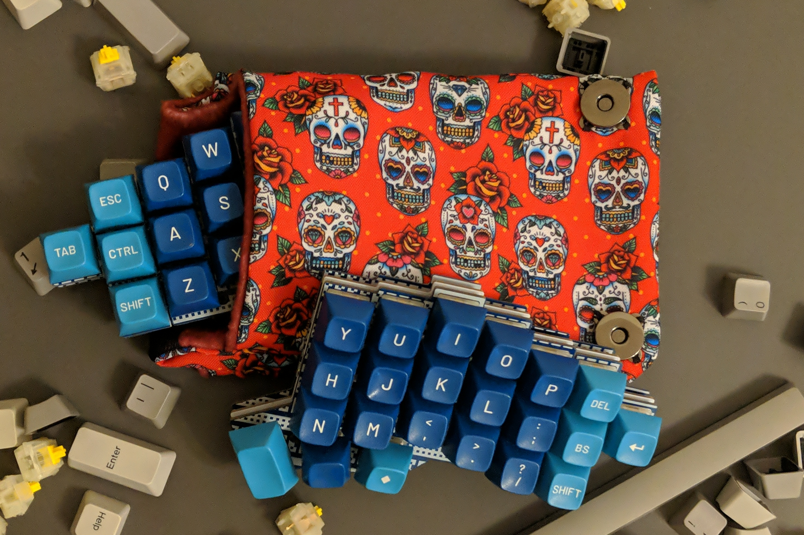

# Skean

The Skean is a 44-key split keyboard inspired by the [Jian](https://github.com/KGOH/Jian-Info) (stagger, pinky and controller footprint) and the 
[Corne](https://github.com/foostan/crkbd) (thumb cluster).
The module placement was inspired by [pashutk](https://github.com/pashutk)'s kbd533 project.

The Skean is a fully wireless split built with E73 nRF52833 modules. It's got side-mounted power and reset switches, USB-C ports, fuses and ESD protection. It also has 310 mAh batteries in each half - about three times the capacity of a typical "under the nice!nano" battery. Despite all that, with specific switches (Alps, Matias, Gateron Cap or etc.) and thin PCBs it can be built with 8 mm. standoffs - the same thickness as a regular hotswap Corne. You are giving up the hotswap capability, but not much else.

And with the V0.3 hotswap PCB you don't even have to give that up!
With 301230 batteries between the PCB and plate the Skean can mount regular MX switches while remaining thin and sleek.

## Features

* Wireless with a built-in E73 module
* ZMK support (currently via a config template)
* Fuses and ESD protection
* MX or Alps compatibility
* Meant for 233350 310 mAh batteries under the PCB or 301230 between the PCB and plate
* Math-generated silkscreens on some case/plate versions
* 6 column version also available for 100x150 PCB promos

## Download

You can download Gerber and DXF files in the [releases section](https://github.com/krikun98/skean/releases).
More images are also in Actions builds.

## Instructions

### Firmware

The [bootloader](../../releases/latest/download/bootloader.hex) is available in the Releases tab.
Please refer to the [nrfmicro wiki](https://github.com/joric/nrfmicro/wiki/bootloader) for the flashing instructions.
It's the same as the nrfmicro_833 bootloader with a modified USB device name.

[Default firmware](../../releases/latest/download/firmware.zip) files are also there, and you can use the [Skean](https://github.com/krikun98/skean-zmk-config) config template for customization.

**IMPORTANT NOTE**: if your Skean was flashed with the bootloader from the 0.2 release, you need to flash the [update UF2](../../releases/V0.2.1/download/bootloader_update.uf2) to use the latest ZMK version.
More info is available in the [Releases](https://github.com/krikun98/Skean/releases/tag/V0.2.1) tab.

### BOM/Build instructions

Please refer to the public [Skean wiki](https://github.com/krikun98/skean/wiki).

For building the artifacts locally you need Docker. 
Just run the `build.sh` script.

However, everything is built in Actions. 
Check the Actions tab or releases for files not linked here.

## Links

### Version 0.3

#### MX hotswap

Full 7-column MX hotswap PCB

[IBOM](https://htmlpreview.github.io/?https://github.com/krikun98/skean/blob/main/pcb/pinky_hotswap/bom/ibom.html)

[gerbers](../../releases/latest/download/pcb_pinky_hotswap_gerbers.zip)

front|back
--|--
|

6-column MX hotswap version

[IBOM](https://htmlpreview.github.io/?https://github.com/krikun98/skean/blob/main/pcb/6col_hotswap/bom/ibom.html)

[gerbers](../../releases/latest/download/pcb_6col_hotswap_gerbers.zip)

front|back
--|--
|

#### Soldered

Soldered V0.3 PCBs have compatibility for:

- MX
- Alps SKCM
- Alps SKCC
- i-Rocks
- Hi-Tek 725
- Omron B3G-S
- Futaba MA

Full 7-column PCB

[IBOM](https://htmlpreview.github.io/?https://github.com/krikun98/skean/blob/main/pcb/pinky/bom/ibom.html)

[gerbers](../../releases/latest/download/pcb_pinky_gerbers.zip)

front|back
--|--
|

6-column version

[IBOM](https://htmlpreview.github.io/?https://github.com/krikun98/skean/blob/main/pcb/6col/bom/ibom.html)

[gerbers](../../releases/latest/download/pcb_6col_gerbers.zip)

front|back
--|--
|

[Case gerbers](../../releases/latest/download/gerber_case_files.zip)

[Case files for laser cutting](../../releases/latest/download/laser_case_files.zip)

All the case files labeled "plastic" have the switch holes adjusted(0.25 mm. smaller in both dimensions).
If your laser cutter has different tolerances - adjust them and re-run the build script.
